  

 

  

 

  
  
  
  
  

 

&nbsp;&nbsp;

&nbsp;&nbsp;

&nbsp;&nbsp;

---

## 💼 Open for client & B2B work

**I take on freelance and contract engagements — and I'm currently delivering a live production B2B system for a client.**

> 🏢 **Live delivery:** A fully automated, 24/7 B2B lead-generation & enrichment pipeline for a client in the migration-services sector — built on self-hosted **n8n**, **PostgreSQL**, and **GPT-4o vision**, running on cloud infrastructure with human-in-the-loop approval over Telegram. Full funnel: scrape → AI website audit → personalised outreach → reply handling → proposal → Stripe payment → onboarding.

**What I build for clients:**
- 🤖 **AI automation & workflow engineering** — n8n pipelines, GPT-4o agents, 15+ API integrations, human-in-the-loop ops
- 🎥 **Computer vision** — detection, classification, video search, surveillance/threat-profiling pipelines
- ⚡ **Edge & on-device AI** — model compression (quantization, pruning, FP16/INT8) to fit constrained hardware
- 🔒 **Offline / on-premise systems** — local RAG, on-prem chatbots, zero-external-API pipelines for sensitive data
- 🧱 **ML backends** — FastAPI / Flask / Django services around your models, with clean REST endpoints

📩 **Let's work together → [vichruth.victorious@gmail.com](mailto:vichruth.victorious@gmail.com)** · 📞 +91-7904815700

---

## 🔭 About me

CSE undergraduate at **VIT Vellore** (B.Tech 2024–2028), currently splitting time across two research internships and active freelance delivery.

- 🔬 **Research Intern @ NIT Trichy** (Jun 2026) — multimodal student engagement detection: overhead CV pipeline on Raspberry Pi + 4-bit quantised local LLM, fully offline.
- 🔬 **Research Intern @ IIIT Kottayam** — person re-identification with TransReID and ViT-MTL architectures; model compression for edge deployment. Patent filed. Paper in progress.

I like the hard, unglamorous part of ML — making heavyweight models small, fast, and actually deployable in the real world.

---

## 🛠️ Tech stack

**Languages & Core**

**ML / AI**

**Backend & Web**

**Tools & Infra**

 

| Domain | Tools |
|--------|-------|
| **ML / DL** | PyTorch · TensorFlow · Hugging Face · scikit-learn · XGBoost · CLIP · TransReID · LoRA/PEFT |
| **Computer Vision** | OpenCV · FAISS · Person Re-ID · CNNs · ViT · Object Detection · ONNX Runtime |
| **Edge AI** | FP16/INT8 Quantization · Model Pruning · TinyML · llama.cpp · Raspberry Pi |
| **AI Automation** | n8n · GPT-4o agents · API integration · PostgreSQL · Telegram bots · Stripe |
| **Backend** | FastAPI · Flask · Django · Node.js · REST APIs |

---

## 🚀 Featured projects

| Project | What it does | Stack |
|---|---|---|
| **B2B Lead-Gen & Enrichment Engine** *(live client)* | 24/7 automated sales pipeline: scrape → AI website audit → outreach → reply handling → proposal → payment → onboarding, phone-controlled | n8n · PostgreSQL · GPT-4o · 15+ APIs |
| **NeuroLog** | Fully offline, zero-shot semantic video search — ~0.284s latency on 1,414-frame FAISS index within 6 GB VRAM (RTX 4050) | PyTorch · CLIP · FAISS · OpenCV |
| **Trans-MTL-ReID** | ViT Multi-Task Re-ID: TransReID + 3 attribute branches + domain adversarial GRL; diagnosed 3 silent architectural failures | PyTorch · TransReID · LoRA · Torchreid |
| **Classroom Attentiveness** *(in progress)* | Edge-native engagement detection — interval CV sampling + LLM aggregation, fully offline on Raspberry Pi 8GB | Python · ONNX · OpenCV · llama.cpp |
| **NIKI-LAUDA-AI** | Real-time race-engineering pipeline decoding 50 Hz binary C-struct telemetry over UDP; LSTM tyre-degradation modelling | Python · UDP · PyTorch · Pandas |
| **Low-Parameter AI Bug Detector** | LoRA-fine-tuned CodeT5 for fully offline AI code fixes — basis for an in-progress research paper | CodeT5 · LoRA/PEFT · Flask |

> More → **[vichruth.github.io](https://vichruth.github.io)**

---

## 🏆 Achievements & competitions

| | Achievement |
|---|---|
| 📄 | **Patent application filed** — embedded ML model memory-optimisation pipeline |
| 📝 | **Research paper in progress** — Person Re-Identification (with Dr. Sridhar Raj S, IIIT Kottayam) |
| 🧪 | **FREUID Challenge 2026** (IJCAI-ECAI) — identity document fraud detection |
| 🥈 | **2nd Prize, Hackademia — graVITas '25** — NLP course-search tool (MiniLM + FastAPI) |
| 🥉 | **2nd Runner-Up, National Ideathon 2024** — predictive torque-vectoring braking system |
| 📊 | **Kaggle: March Mania 2026** — NCAA probability classification with leakage-safe feature engineering |

---

## 📊 GitHub stats

  
  

 

  

 

  

---

  

